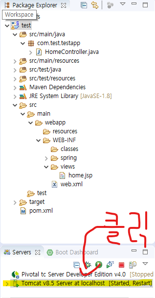
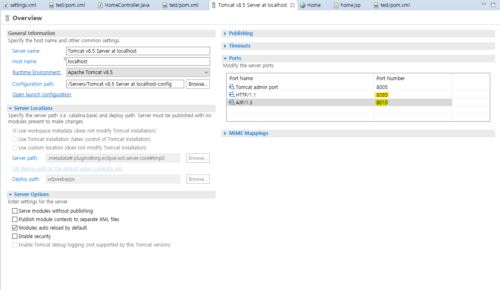

# 트렐로 복제 - 전현진, 정혁진, 정소현

1. ### 목적

   - 트렐로를 복제를 통해 전반적인 웹의 흐름을 공부한다.

   ### 사용 툴

   1. 프론트
      - html , css , JS , React ,JQuery, 
   2. 서버
      1. servlet , spring - **3.9.11 RELEASE**(maven - **3.6.2**), tomcat(**8.5**)
   3. 백
      1. RDBMS(oracle db)  - ora11g_xe

   ### 웹 페이지 종류

   1. main.html
   2. login.html
   3. join.html
   4. content.html
   5. board.html

   

   

   

   -------------

   #### 진행사항

   maven 설치중 오류 발생 -- 2020.01.10

   > - 상황
   >   - sts와 eclipse를 설치 완료하고 maven과의 연동을 함
   > - 문제
   >   - maven 설치를 sts가 아닌 eclipse에 하는데 무한 다운 에러가 생겨서 고민
   > - 해결 
   >   - sts에서 maven 설정을 하니 maven 오류가 나지 않음 
   >   - [해결](https://aristatait.tistory.com/65) 사이트

   pom.xml에서 default 설정 완료 --2020.01.10

   > - `<java-version>`  1.8로 변경
   > - `<org.springframework-version>` 4.3.3.RELEASE로 변경
   > - `<plugin>` 중 `<source>`, `<target>`1.8로 변경
   > - [설치2](https://all-record.tistory.com/156) 사이트 참고

   spring과 톰캣 연동 완료 -- 2020.01.10

   > - [설치1](https://all-record.tistory.com/46) [설치2](https://all-record.tistory.com/156) 순서대로 설치

    코드 실행 시 포트 중복 에러 해결 완료 -- 2020.01.10

   > - 상황
   >   - HomeController.java를 tomcat서버를 통해 브라우저에 home.jsp를 올림
   > - 문제
   >   - 다음과 같은 오류 발생
>
   > ```word
   > starting tomcat v8.5 server at localhost has encountered a problem
   > ```
>
   > - 해결 
>
   >   - 오류를 좀더 자세하게 보면 8080 , 8009포트를 oracle에서 사용하고 있다고 한다 그래서 수동으로 tomcat 포트 번호를 바꿔주면 해결 가능하다 
>
   >   
>
   >   - 
>
   >   
>
   >   
>
   >   - servers에서 Tomcat 을 실행해준다
>
   >     
   >
   >   - 다음과 같은 페이지가 나오는데 HTTP/1.1이 8080 , AJP가 8009으로 되있다면 윗 사진과 같이 변경한다.
   >
   >   - [해결](https://coding-factory.tistory.com/13)  사이트

코드 실행 시 한글 깨짐 현상이 발생 -- 2020.01.10

   > - 상황
   >   - 코드 실행
   > - 문제
   >   - 브라우저에서 한글 깨짐
   > - 해결
   >   - home.jsp파일에 다음 코드를 추가
   >
   > ```jsp
   > <%@ page language="java" contentType="text/html; charset=UTF-8" pageEncoding="UTF-8" %>
   > <!-- UTF-8인코딩을 하기 위한 코드 -->
   > <!--상단에 추가해 준다. ->
   > ```

---------------------

IOC 사용해서 객체 만들고 사용해보기 -- 2020.1.22

> - 상황
>
>   - main.jsp에서 인스턴스(new) 생성 없이 Calculation 클래스 사용
>
>   ``` java
>   // main
>   package com.test.cal;
>   
>   import org.springframework.context.support.AbstractApplicationContext;
>   import org.springframework.context.support.GenericXmlApplicationContext;
>   
>   public class main {
>   
>   	public static void main(String[] args) {
>   		// TODO Auto-generated method stub
>           //bean에 등록한 객체들을 담고있는 파일 주소 지정
>   		String configLocation = "classpath:spring/application-config.xml";
>   		//이부분은 누가 좀 채워 줘욥
>           //햇깔림 ㅠㅠㅠ
>   		AbstractApplicationContext ctx = 
>   	            new GenericXmlApplicationContext(configLocation);
>   		// ctx.getBean(빈에 등록한 클래스의 id값, 클래스 실제 이름)
>           //new로 인한 의존성 대신 loc에 등록되어있는 Calculation을 사용하기 위한 메서드
>   		Calculation cal = ctx.getBean("cal",Calculation.class);
>   		
>   		//Calculation에 있는 print_() 메서드 호출
>   		cal.print_();
>   	}
>   
>   }
>   
>   ```
>   -  beans에 등록된 calPrint 클래스를 loc를 이용해서 사용 -- 2020.1.21
>
>   ```java
>   package com.test.cal;
>   
>   public class Calculation {
>   	//bean에 등록 시켜 놓음으로서 new 인스터스 생성 필요 없음
>   	CalPrint calPrint;
>   
>   	//필드 변수 a , b정의
>   	int a;
>   	int b;
>   
>   	//---- CalPrint()의 get-set 메서드
>   	public CalPrint getCalPrint() {
>   		return calPrint;
>   	}
>   	// Calculation에서 bean에 등록되어 있는 CalPrint를 사용하기 위해서는 setter 메서드가 필요하다 
>   	public void setCalPrint(CalPrint calPrint) {
>   		this.calPrint = calPrint;
>   	}
>   	//---- CalPrint()의 get-set 메서드	
>       //---- a, b의 get-set메서드 
>   	public int getA() {
>   		return a;
>   	}
>   
>   	public void setA(int a) {
>   		this.a = a;
>   	}
>   
>   	public int getB() {
>   		return b;
>   	}
>   
>   	public void setB(int b) {
>   		this.b = b;
>   	}
>       //---- a, b의 get-set메서드 
>   	public void print_() {
>           //calPrint에 있는 myPrint메서드에 xml에서 value값으로 받은 a,b를 인수로 넘김
>   		calPrint.myPrint(this.a , this.b);
>   	}
>   
>   }
>   ```
>
>   - CalPrint 클래스 myPrint()--2020.1.21
>
>   ```java
>   package com.test.cal;
>   
>   public class CalPrint {
>   
>       //Calculation print_() 메서드로 인해 받은 a,b를 +한 후 출력
>   	public void myPrint(int a , int b) {
>   		System.out.println("더한 값은, "+(a+b));
>   	}
>   }
>   ```
>
>   - application-config.xml 사용
>
>   ``` xml
>   <?xml version="1.0" encoding="UTF-8"?>
>   <beans xmlns="http://www.springframework.org/schema/beans"
>   	xmlns:xsi="http://www.w3.org/2001/XMLSchema-instance"
>   	xsi:schemaLocation="http://www.springframework.org/schema/beans http://www.springframework.org/schema/beans/spring-beans.xsd">
>   
>       <-->CalPrint를 bean등록 id 는 CalPrint</-->
>   	<bean id = "CalPrint" class = "com.test.cal.CalPrint">
>   	</bean>
>   	<-->Calculation을 bean등록 id cal</-->
>   	<bean id = "cal" class = "com.test.cal.Calculation">
>           <-->Calculation 클레스에서 calPrint를 사용하기 때문에 property 태그를 이용해서 ref 		   지정</-->
>   		<property name="calPrint">
>   			<ref bean="CalPrint"></ref>
>   		</property>
>           <-->Calculation의 setA의 메서드를 사용하기 위해 name에 set을 지우고 첫 글자가 대문			자라면 소문자로 바꾼뒤 name을 지정한다</-->
>           <-->value는 임의로 지정한다</-->
>   		<property name="a" value = "1"></property>
>   		<property name="b" value = "2"></property>
>   	</bean>
>   </beans>
>   ```
>
>   
